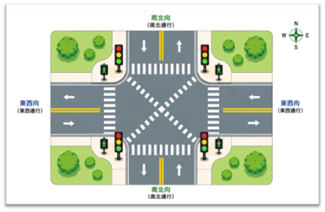
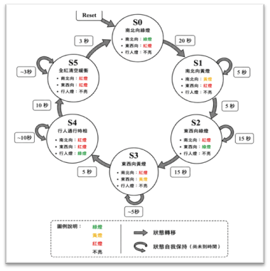
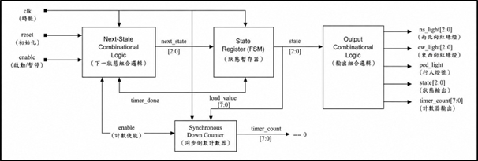

# Smart Traffic Light Control System

## Project Overview

This project implements a smart traffic light control system using Verilog HDL and Moore FSM architecture.

The system supports:
- North-South traffic control
- East-West traffic control
- Pedestrian crossing mode
- All Red Clearance phase

A synchronous down counter is used to control timing and state transitions.

---

## Features

- Moore FSM architecture
- Synchronous timer control
- Pedestrian crossing support
- All Red Phase safety mechanism
- Self-checking testbench
- Waveform verification

---

## State Flow

S0 → S1 → S2 → S3 → S4 → S5 → S0

- S0 : NS Green
- S1 : NS Yellow
- S2 : EW Green
- S3 : EW Yellow
- S4 : Pedestrian Walk
- S5 : All Red Clearance

---

## Tools

- Verilog HDL
- Quartus Prime 20.1
- ModelSim / ncverilog

---

## Verification

The project uses waveform analysis and self-checking testbench verification.

Test items include:
- FSM state transition
- Timer synchronization
- Traffic light correctness
- Pedestrian mode
- All Red Phase operation

---

## Report

See:
- HW4_B133012015.pdf

---

## Author

Department of Electrical Engineering  
National Sun Yat-sen University

---

## Project Diagrams

### Smart Intersection Concept

### FSM State Diagram

### Hardware Architecture

